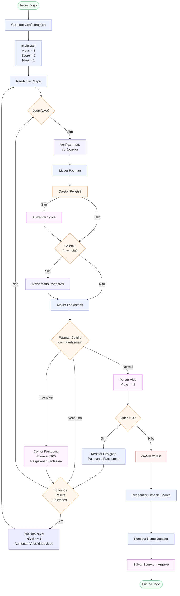
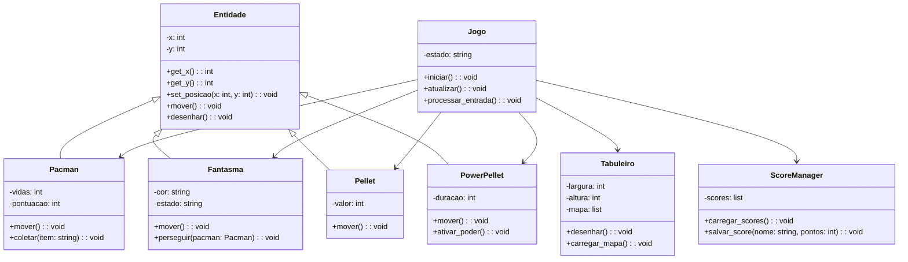

# 1ª Atividade Parcial do Projeto 2 - Jogo PAC MAN

**Disciplina**: Análise, Projeto e Programação Orientada a Objetos  
**Prof(a)**: Luiza Bernardes Real  
**Grupo**: PAC MAN  
**Turma**: ______________________

## Integrantes do Grupo
- João Marcos Claro Porcino
- Arthur Samuel Ferreira Andrade
- Dante Junqueira Pedrosa
- Paulo Henrique Soares Gomes

---

## 1. Tema do Projeto
O tema do Projeto 2 é o **Jogo Arcade PAC MAN**, um jogo em Python que simula o labirinto, a coleta de pellets e a perseguição dos fantasmas, aplicando princípios de orientação a objeto.

## 2. Conceitos de POO Aplicados
- **a) Classes**: Usaremos classes para representar os principais elementos do jogo, como `Entidade`, `Pacman`, `Fantasma`, `Pellet`, `PowerPellet`, `Tabuleiro` e `Jogo`. Cada classe encapsula atributos e comportamentos específicos.
- **b) Herança**: A herança aparecerá na especialização das entidades. `Pacman`, `Fantasma`, `Pellet` e `PowerPellet` herdarão de `Entidade`, reaproveitando propriedades de posição e métodos básicos.
- **c) Polimorfismo**: O polimorfismo ocorrerá no método `mover()`: `Pacman` move-se com base na entrada do jogador, `Fantasma` move-se com IA/randomização e `Pellet`/`PowerPellet` podem ter comportamento passivo ou efeitos próprios ao serem coletados.
- **d) Classes Abstratas**: A classe `Entidade` atuará como abstrata, definindo a estrutura de `mover()`, `desenhar()` e atributos de posição que não devem ser instanciados diretamente.

## 3. Fluxograma Simples



## 4. Diagrama UML de Classes



## 5. Banco de Dados

**Formato escolhido**: Arquivo CSV, por ser simples de ler/escrever e compatível com estruturas nativas de Python.

**Código de Leitura, Operação e Gravação (`salvar_score.py`)**:
```python
import csv

ARQUIVO_BD = 'scores.csv'


def ler_scores():
    with open(ARQUIVO_BD, 'r', newline='', encoding='utf-8') as f:
        reader = csv.DictReader(f)
        return [row for row in reader]


def salvar_scores(scores):
    fieldnames = ['nome', 'pontos', 'data']
    with open(ARQUIVO_BD, 'w', newline='', encoding='utf-8') as f:
        writer = csv.DictWriter(f, fieldnames=fieldnames)
        writer.writeheader()
        writer.writerows(scores)


def registrar_score(nome, pontos):
    dados = ler_scores()
    novo_score = {
        'nome': nome,
        'pontos': pontos,
        'data': '2026-06-02'
    }
    dados.append(novo_score)
    salvar_scores(dados)
    print(f'Score registrado para {nome} com {pontos} pontos.')
    return dados


if __name__ == '__main__':
    registrar_score('Pacman', 1250)
```

**Base de dados original (`scores.csv`)**:
```csv
nome,pontos,data,nivel
Alice,980,2026-05-20,10
```

**Resultado após leitura, operação e gravação**:
```text
Score registrado para Pacman com 1250 pontos.
```

**Base de dados atualizada (`scores.csv`)**:
```csv
nome,pontos,data,nivel
Alice,980,2026-05-20,10
Pacman,1250,2026-06-02,2
```

## 6. Interface Gráfica
O grupo **não** utilizará interface gráfica (GUI). O jogo será executado no **terminal**, exibindo o estado do labirinto e as ações do jogador via texto.

## 7. Divisão das Implementações
As tarefas foram subdivididas entre os integrantes da seguinte forma:

- **João Marcos Claro Porcino**: Modelagem das classes `Entidade`, `Pacman`, `Fantasma`, `Pellet` e `PowerPellet` e implementação dos comportamentos de entidade.
- **Arthur Samuel Ferreira Andrade**: Modelagem de `Tabuleiro`, `Jogo` e lógica de movimentação, colisões e regras de pontuação.
- **Dante Junqueira Pedrosa**: Persistência em JSON, leitura/escrita de scores, I/O de arquivos e relatório de resultados.
- **Paulo Henrique Soares Gomes**: Interface de terminal, entrada do jogador, controle de fluxo do jogo e integração geral do código.