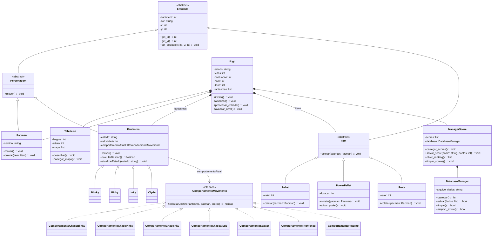

# 2ª Atividade Parcial do Projeto 2 - Jogo PAC MAN

**Disciplina**: Análise, Projeto e Programação Orientada a Objetos  
**Prof(a)**: Luiza Bernardes Real  
**Grupo**: PAC MAN  

## Integrantes do Grupo
- João Marcos Claro Porcino
- Arthur Samuel Ferreira Andrade
- Dante Junqueira Pedrosa
- Paulo Henrique Soares Gomes

## Sumário

1. [Tema do Projeto](#1-tema-do-projeto)
2. [Diagrama UML e Alterações](#2-diagrama-uml-e-alterações)
3. [Interface Gráfica Proposta](#3-interface-gráfica-proposta)
   - [3.1 Tela de Menu Inicial](#31-tela-de-menu-inicial)
   - [3.2 Tela de Execução do Jogo](#32-tela-de-execução-do-jogo)
4. [Implementação da Persistência de Dados do Score](#4-implementação-da-persistência-de-dados-do-score)
5. [Propostas de Expansão](#5-propostas-de-expansão---sistema-de-salvamento-de-partida)
6. [Referências](#6-referências)

---

## 1. Tema do Projeto
O tema do Projeto 2 é o **Jogo Arcade PAC MAN**, um jogo em Python que simula o labirinto, a coleta de pellets e a perseguição dos fantasmas, aplicando princípios de orientação a objeto.

## 2. Diagrama UML e Alterações

Em relação à primeira atividade parcial, foram realizadas as seguintes alterações:

- Criação da classe abstrata `Personagem`, da qual herdam `Pacman` e `Fantasma`.
- Criação da classe abstrata `Item`, da qual herdam `Pellet`, `PowerPellet` e Fruta.
- Inclusão da classe `Fruta`, representando itens bônus do jogo.
- Inclusão do atributo nivel na classe Jogo.
- Alteração do método `Pacman.coletar()`, que agora recebe um objeto do tipo `Item` em vez de uma `string`.
- Inclusão da interface `IComportamentoMovimento` e das classes de comportamento dos fantasmas, permitindo diferentes estratégias de movimentação.
- Criação da classe `DatabaseManager` para encapsular a persistência dos scores.
- Alteração da relação entre `Jogo` e os itens, que agora são armazenados em uma lista de objetos Item.
- Separação das responsabilidades entre `ManagerScore` (regras de negócio dos scores) e `DatabaseManager` (acesso aos dados).

Essas alterações tornaram o projeto mais modular e aderente aos princípios de orientação a objetos, principalmente abstração, encapsulamento e polimorfismo.



## 3. Interface Gráfica Proposta

### 3.1. Tela de Menu Inicial

A primeira tela apresentada ao usuário permite inserir seu nome e visualizar as opções iniciais do jogo, incluindo a consulta ao ranking de scores.


### 3.2. Tela de Execução do Jogo

Durante a partida, o labirinto é exibido utilizando caracteres ASCII no terminal. Nesta tela são apresentados o mapa, a posição do Pac-Man, dos fantasmas, a pontuação atual, vidas restantes e o nível.


## 4. Implementação da Persistência de Dados do Score

A classe ManagerScore é responsável por gerenciar o ranking dos jogadores, armazenando, consultando e organizando os scores obtidos durante as partidas.

- `__init__()`: Inicializa a classe, cria uma conexão com o DatabaseManager e carrega os scores já existentes.
- `adicionar_score()`: Adiciona um novo score ao ranking, incluindo nome do jogador, pontuação, nível alcançado e data da partida.
- `obter_top_scores()`: Retorna os melhores scores registrados, limitando a quantidade de resultados exibidos.
- `obter_score_jogador()`: Busca todos os scores registrados por um determinado jogador.
- `obter_melhor_score_jogador()`: Retorna apenas o melhor score de um jogador específico.
- `ordenar_scores()`: Ordena os scores pela pontuação e, em caso de empate, pelo nível alcançado.
- `limpar_scores()`: Remove todos os scores armazenados e atualiza o arquivo de persistência.
- `exibir_ranking()`: Gera uma representação textual do ranking para exibição no terminal.
- `remover_score()`: Remove um score específico do sistema.
obter_total_scores(): Retorna a quantidade total de scores armazenados.

A escolha dessa classe ocorreu porque ela demonstra encapsulamento e separação de responsabilidades, já que toda a lógica de manipulação dos scores está centralizada nela.

A classe DataBaseManager foi também incluída para fins de interfaze e demonstração.


```python
# ManagerScore.py

from datetime import datetime
from DatabaseManager import DatabaseManager


class ManagerScore:
    """
    Gerenciador de Scores do jogo Pac-Man.
    Responsável por gerenciar, ordenar e consultar scores dos jogadores.
    """
    
    def __init__(self, db_manager=None):
        self.db = db_manager if db_manager else DatabaseManager()
        self.scores = self.db.carregar()
    
    def adicionar_score(self, nome, pontos, nivel=1):
        if not nome or pontos < 0:
            return False
        
        score_entry = {
            'nome': nome,
            'pontos': pontos,
            'nivel': nivel,
            'data': datetime.now().strftime('%Y-%m-%d %H:%M:%S')
        }
        
        self.scores.append(score_entry)
        self.ordenar_scores()
        return self.db.salvar(self.scores)
    
    def obter_top_scores(self, quantidade=10):
        return self.scores[:quantidade]
    
    def obter_score_jogador(self, nome):
        return [score for score in self.scores if score['nome'].lower() == nome.lower()]
    
    def obter_melhor_score_jogador(self, nome):
        scores_jogador = self.obter_score_jogador(nome)
        return scores_jogador[0] if scores_jogador else None
    
    def ordenar_scores(self):
        self.scores.sort(key=lambda x: (-x['pontos'], -x['nivel']))
    
    def limpar_scores(self):
        self.scores = []
        return self.db.salvar(self.scores)
    
    def exibir_ranking(self, quantidade=10):
        top_scores = self.obter_top_scores(quantidade)
        
        if not top_scores:
            return "Nenhum score registrado ainda."
        
        ranking = "=" * 70 + "\n"
        ranking += f"{'POS':<5} {'JOGADOR':<20} {'PONTOS':<10} {'NÍVEL':<10} {'DATA':<15}\n"
        ranking += "-" * 70 + "\n"
        
        for idx, score in enumerate(top_scores, 1):
            ranking += f"{idx:<5} {score['nome']:<20} {score['pontos']:<10} {score['nivel']:<10} {score['data']:<15}\n"
        
        ranking += "=" * 70
        return ranking
    
    def remover_score(self, nome, pontos):
        for score in self.scores:
            if score['nome'] == nome and score['pontos'] == pontos:
                self.scores.remove(score)
                return self.db.salvar(self.scores)
        return False
    
    def obter_total_scores(self):
        return len(self.scores)
```


```python
# DatabaseManager.py

import json
import os


class DatabaseManager:
    """
    Gerenciador de persistência em banco de dados (JSON).
    Responsável exclusivamente por operações de leitura e escrita de dados.
    """
    
    def __init__(self, arquivo_dados='scores.json'):
        """
        Inicializa o gerenciador de banco de dados.
        
        Args:
            arquivo_dados (str): Caminho do arquivo para persistência
        """
        self.arquivo_dados = arquivo_dados
    
    def carregar(self):
        """
        Carrega dados do arquivo JSON.
        
        Returns:
            list: Lista de scores ou lista vazia se arquivo não existe
        """
        if os.path.exists(self.arquivo_dados):
            try:
                with open(self.arquivo_dados, 'r', encoding='utf-8') as arquivo:
                    dados = json.load(arquivo)
                    return dados if isinstance(dados, list) else []
            except (IOError, json.JSONDecodeError) as e:
                print(f"Erro ao carregar dados: {e}")
                return []
        return []
    
    def salvar(self, dados):
        """
        Salva dados no arquivo JSON.
        
        Args:
            dados (list): Lista de scores a salvar
        
        Returns:
            bool: True se salvo com sucesso, False caso contrário
        """
        try:
            with open(self.arquivo_dados, 'w', encoding='utf-8') as arquivo:
                json.dump(dados, arquivo, ensure_ascii=False, indent=4)
            return True
        except IOError as e:
            print(f"Erro ao salvar dados: {e}")
            return False
    
    def limpar(self):
        """
        Limpa o arquivo de dados (salva lista vazia).
        
        Returns:
            bool: True se limpo com sucesso
        """
        return self.salvar([])
    
    def arquivo_existe(self):
        """
        Verifica se o arquivo de dados existe.
        
        Returns:
            bool: True se arquivo existe
        """
        return os.path.exists(self.arquivo_dados)
```

## 5. Propostas de expansão - Sistema de Salvamento de Partida

Uma possível expansão do projeto seria permitir que o jogador salvasse uma partida em andamento para continuar posteriormente.

A classe que mais facilitaria essa implementação seria DatabaseManager, pois ela já é responsável pela persistência dos dados do jogo. Bastaria expandir sua funcionalidade para armazenar também informações como posição do Pac-Man, posição dos fantasmas, pontuação, vidas e nível atual.

Como a persistência já está encapsulada nessa classe, seria possível adicionar essa funcionalidade sem modificar significativamente as demais classes do projeto.

## 6. Referências 

1. SHIVANG KUMAR. Pac-Man with OOP. Medium, 2020. Disponível em: https://medium.com/@shivangk1407/pac-man-with-oop-1a26ae6c3c87. Acesso em: 10 jun. 2026.
2. CODE2BITS. Pac-Man Patterns – Ghost Movement Strategy Pattern. DEV Community, 2020. Disponível em: https://dev.to/code2bits/pac-man-patterns--ghost-movement-strategy-pattern-1k1a. Acesso em: 10 jun. 2026.
