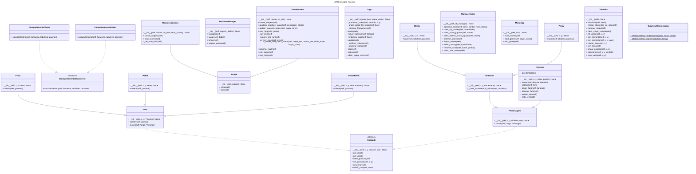

```mermaid
---
title: UFMG-ELE631-Pacman
---
classDiagram
    class Entidade {
        <<abstract>>
        - \_\_init__(self, x, y, caracter, cor) None
        + get_x(self)
        + get_y(self)
        + obter_posicao(self)
        + set_posicao(self, x, y)
        + desenhar(self)
        + colidir_com(self, outra)
    }

    class Personagem {
        - \_\_init__(self, x, y, simbolo, cor) None
        + mover(self, *args, **kwargs)*
    }

    class Fantasma {
        - \_\_init__(self, x, y, cor, estado) None
        - \_obter_movimentos_validos(self, tabuleiro)
    }

    class Blinky {
        - \_\_init__(self, x, y) None
        + mover(self, tabuleiro, pacman)
    }

    class IComportamentoMovimento {
        <<abstract>>
        + calcularDestino(self, fantasma, tabuleiro, pacman)*
    }

    class ComportamentoChase {
        + calcularDestino(self, fantasma, tabuleiro, pacman)
    }

    class ComportamentoScatter {
        + calcularDestino(self, fantasma, tabuleiro, pacman)
    }

    class DatabaseManager {
        - \_\_init__(self, arquivo_dados) None
        + carregar(self)
        + salvar(self, dados)
        + limpar(self)
        + arquivo_existe(self)
    }

    class Item {
        - \_\_init__(self, x, y, **kwargs) None
        + coletar(self, pacman)*
        + mover(self, *args, **kwargs)
    }

    class Fruta {
        - \_\_init__(self, x, y, valor) None
        + coletar(self, pacman)
    }

    class Screen {
        - \_\_init__(self, master) None
        + show(self)
        + hide(self)
    }

    class GameScreen {
        - \_\_init__(self, master, on_exit) None
        + create_widgets(self)
        + atualizar_interface_status(self, mensagem_alerta)
        + update_map(self, mapa_text, mapa_cores)
        + start_loop(self, game)
        - \_run_step(self)
        - \_resume_and_run(self)
        - \_on_key_press(self, event)
        - \_render_and_check_status(self, mapa_text, status_text, vidas_antes, mapa_cores)
        + proximo_nivel(self)
        + exit_game(self)
        + stop_loop(self)
    }

    class Jogo {
        - \_\_init__(self, jogador, fase, mapa_vazio) None
        - \_processar_coleta(self, simbolo, x, y)
        - \_ghost_speed_for_phase(self, fase)
        - \_carregar_fantasmas(self)
        + iniciar(self)
        + mover_pacman(self, direcao)
        + renderizar_jogo(self, fancy)
        + update(self)
        - \_verificar_colisoes(self)
        - \_atualizar_status(self)
        + stop(self)
        + status(self)
        + obter_mapa_cores(self)
    }

    class MainMenuScreen {
        - \_\_init__(self, master, on_start, read_scores) None
        + create_widgets(self)
        + load_scores(self)
        - \_on_start_click(self)
    }

    class ManagerScore {
        - \_\_init__(self, db_manager) None
        + adicionar_score(self, nome, pontos, nivel, vitoria)
        + obter_top_scores(self, quantidade)
        + obter_score_jogador(self, nome)
        + obter_melhor_score_jogador(self, nome)
        + ordenar_scores(self)
        + limpar_scores(self)
        + exibir_ranking(self, quantidade)
        + remover_score(self, nome, pontos)
        + obter_total_scores(self)
    }

    class MenuApp {
        - \_\_init__(self, root) None
        + read_scores(self)
        + start_game(self, player_name)
        + end_game(self)
    }

    class Pacman {
        + dict DIRECOES
        - \_\_init__(self, x, y, vidas, pontos) None
        + mover(self, direcao, tabuleiro)
        + coletar(self, item)
        + ativar_furia(self, duracao)
        + diminuir_furia(self)
        + perder_vida(self)
        + esta_vivo(self)
    }

    class Pellet {
        - \_\_init__(self, x, y, valor) None
        + coletar(self, pacman)
    }

    class Pinky {
        - \_\_init__(self, x, y) None
        + mover(self, tabuleiro, pacman)
    }

    class PowerPellet {
        - \_\_init__(self, x, y, valor, duracao) None
        + coletar(self, pacman)
    }

    class Tabuleiro {
        - \_\_init__(self) None
        + inicializar(self, vazio)
        - \_limpar_elementos_de_jogo(self)
        + carregar_mapa(self)
        + obter_mapa_copiado(self)
        + eh_valido(self, x, y)
        + get_elemento(self, x, y)
        + set_elemento(self, x, y, valor)
        + coletar_item(self, x, y)
        + tem_itens(self)
        + limpar_posicao(self, x, y)
        + posicionar(self, x, y, simbolo)
        + esta_vazio(self, x, y)
    }

    class TabuleiroRenderizador {
        + @staticmethod renderizar(tabuleiro, fancy, mapa)$
        + @staticmethod imprimir(tabuleiro, fancy)$
    }

    ComportamentoChase ..|> IComportamentoMovimento

    ComportamentoScatter ..|> IComportamentoMovimento

    Fantasma --|> Personagem

    Blinky --|> Fantasma

    Pinky --|> Fantasma

    Fruta --|> Item

    Item ..|> Entidade

    Pacman --|> Personagem

    Pellet --|> Item

    Personagem ..|> Entidade

    PowerPellet --|> Item

    MainMenuScreen --|> Screen

    GameScreen --|> Screen
```
